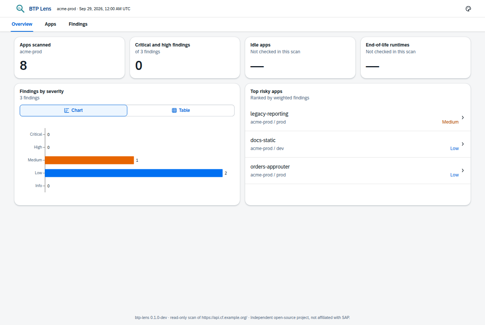
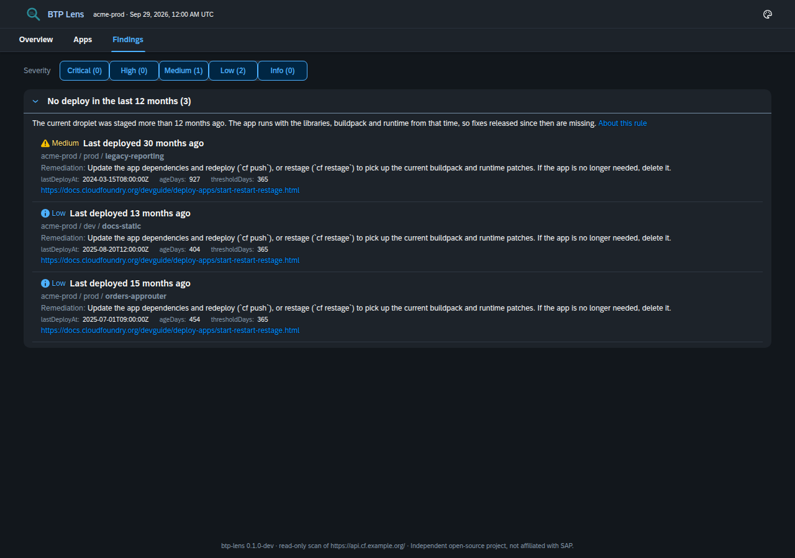
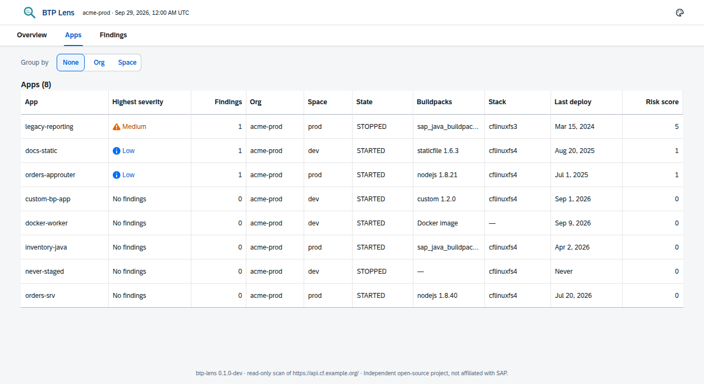

# BTP Lens

**A read-only health and security scanner for Cloud Foundry landscapes on SAP BTP.** It is free, open source, and runs on your machine.

Point BTP Lens at a Cloud Foundry org. With nothing more than the **Space Auditor** role, it inventories every app, flags stale deployments, end-of-life runtimes, outdated buildpacks and libraries, known vulnerabilities and risky configuration, and writes an **offline HTML report** plus JSON, CSV and SARIF.

It sends only `GET` requests to the Cloud Foundry API. It contacts no third party except for public version and vulnerability lookups, and it never writes user names, tokens or secret values into its output.

> **Status: v0.1 in development.** This build includes the app inventory, the `APP_NO_RECENT_DEPLOY` rule, all report formats and the HTML report. The other v0.1 rules land in the next slices (see [docs/rules.md](docs/rules.md)). Nothing is published to npm yet.



## Quickstart

Once 0.1.0 is published:

```sh
cf login -a https://api.cf.eu10.hana.ondemand.com      # any user with Space Auditor
npx btp-lens scan --api https://api.cf.eu10.hana.ondemand.com --org my-org
open reports/btp-lens-report.html                      # works offline
```

Until then, run it from source (Node.js 22.12 or later):

```sh
git clone https://github.com/sebastianomarchesini/BTP-Lens.git && cd BTP-Lens
npm ci && npm run build
node packages/cli/dist/cli.js scan --api https://api.cf.eu10.hana.ondemand.com --org my-org
```

### Credentials

BTP Lens uses the first of these that is set:

1. `BTP_LENS_ACCESS_TOKEN`, for example `BTP_LENS_ACCESS_TOKEN="$(cf oauth-token)"`.
2. `BTP_LENS_CLIENT_ID` and `BTP_LENS_CLIENT_SECRET`, for an OAuth client with a CF role.
3. Your cf CLI session (`~/.cf/config.json`, or `$CF_HOME/.cf/config.json`). It must target the same API as `--api`. An expired token is refreshed in memory only, and the file is never written.

Behind a corporate proxy, set `NODE_USE_ENV_PROXY=1` so that Node.js honours `HTTPS_PROXY`.

## Commands

```text
btp-lens scan   --api <cf api url> --org <name> [--space <name>] [--deep] [--no-probe-routes]
                [--out ./reports] [--format html,json,csv,sarif] [--fail-on <severity>] [--concurrency 5]
btp-lens report --from <snapshot.json> [--format html,json,csv,sarif] [--out ./reports] [--fail-on <severity>]
btp-lens version
```

- `scan` writes one snapshot (`snapshot-<time>.json`) and the requested reports.
- `report --from` re-runs every rule on a snapshot **offline**, for example after you upgrade BTP Lens.
- Exit codes:
  - `0`: no findings at or above `--fail-on` (the default, `none`, never fails).
  - `1`: findings met the threshold.
  - `2`: tool error.

The HTML report is a single file. Fonts, themes and data are embedded, it follows your light or dark system setting, and it works at phone width. The CSV output neutralizes spreadsheet formulas, and the SARIF output (2.1.0) is ready for code-scanning tools.

## Permissions

| Check | Minimum CF role | Default |
| --- | --- | --- |
| App inventory, droplets, processes, buildpacks, stacks, routes, binding metadata | Space Auditor | on |
| Plain-text secrets in environment variable **names** (`ENV_SECRET_PLAINTEXT`) | Space Developer or Space Supporter | `--deep` only |

When a call returns 403, the check is recorded as *skipped: insufficient role* and the scan continues. Details are in [docs/permissions.md](docs/permissions.md).

## Privacy

- **Read-only:** the HTTP client refuses any method other than `GET` to the CF API. The only `POST` requests go to the OAuth token endpoint and to the OSV.dev vulnerability batch API.
- **No data leaves your machine:** requests go only to your CF API, UAA and log cache, and to `api.osv.dev`, `endoflife.date`, `ui5.sap.com` (version overview) and `registry.npmjs.org` (four `@sap/*` packages). There is no telemetry.
- **No personal data:** user names, emails and IDs are never written. Audit-event actors are dropped when the events are read.
- **No secrets:** tokens, environment variable values and service credentials are never printed or stored. Credentials in buildpack URLs are stripped.

See [docs/privacy.md](docs/privacy.md) and [docs/data-sources.md](docs/data-sources.md).

## Sample report

| Findings (dark theme) | Apps |
| --- | --- |
|  |  |

These screenshots use the synthetic `acme-prod` fixture landscape. Run `npm run sample` to generate the same report in `reports/sample/`.

## Development

```sh
npm ci
npm run build        # UI single-file template, then the CLI
npm test             # unit and fixture tests (no live calls)
npm run lint && npm run typecheck && npm run format:check
npm run sample       # sample reports from the fixture snapshot
npm run e2e          # opens the HTML report with networking disabled (Playwright)
```

The repository is an npm workspaces monorepo:
- `packages/cli` holds the `btp-lens` CLI.
- `packages/ui` holds the React and UI5 Web Components report.
- `docs/` holds the verified data sources, rules, permissions and privacy notes.

Contributions need a signed CLA; see [CONTRIBUTING.md](CONTRIBUTING.md). To report a vulnerability, see [SECURITY.md](SECURITY.md).

## Not affiliated with SAP

BTP Lens is an independent open-source project. It is **not affiliated with, endorsed by or sponsored by SAP SE** or its affiliates. "SAP", "SAP BTP", "SAPUI5" and "Fiori" are trademarks of SAP SE, used here only to describe compatibility. The report uses the open-source UI5 Web Components (Apache-2.0) for its look and feel, and carries no SAP logo.

## License

[Apache-2.0](LICENSE). Third-party notices are in [NOTICE](NOTICE), and every HTML report embeds the licenses of the software it bundles.
